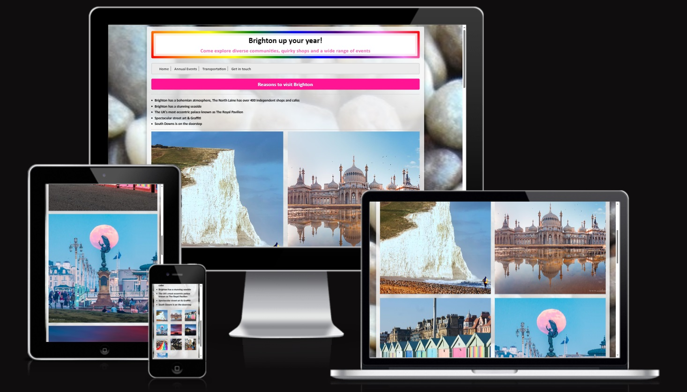
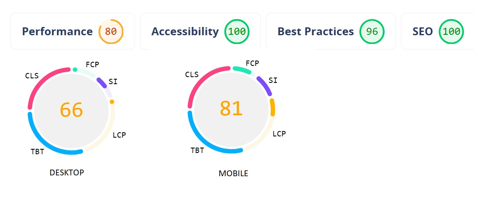

# Brighton Annual Events

 This project aims to provide insights into the vibrant events occurring in Brighton year-round. I chose to focus my initial portfolio on Brighton due to its dynamic appeal, welcoming diverse groups such as families, couples, and party-goers with its unique charm. By showcasing the array of annual events hosted in Brighton, I hope to offer compelling reasons for people to explore this lively city.

My website will highlight the various events that take place each month, offering visitors suggestions on the best times to visit and showcasing the myriad reasons why Brighton should be their next destination..

## TABLE OF CONTENTS

- [User Experience](#user-experience)
- [Technologies Used](#technologies-used)
- [Testing](#testing)
- [Deployment](#deployment)
- [Citations](#citations)
- [Features](#features)

## User Experience 

### Colour scheme

The color palette I've selected for my website draws inspiration from the LGBTQ flag, a symbol frequently associated with Brighton. Additionally, I've incorporated pink into the design as a personal touch, adding a bit of my own flair to the site.

### Font choice

I've chosen a straightforward and user-friendly font for the website. To balance the vivid colors that catch the eye, I opted for simpler fonts to avoid overwhelming visitors, ensuring a smooth and accessible browsing experience

### User experience

My goal is to engage users with the content on the site, ensuring they find it interesting and informative. To achieve this, I've enriched the homepage with photographs and added links to YouTube channels for each event. This approach is designed to offer visitors a glimpse into the events, helping them visualize the experiences. Additionally, I aim to facilitate easy access to assistance through a 'contact us' section, where users can reach out for more information or support.

### PP4 

The videos featured on my website are directly connected to the events discussed. I have placed these videos beneath each event title, aiming to provide further insights beyond the information available on the site.

## Technologies Used

### HTML 

I employed HTML as the markup language across my code to structure and present content on the web effectively.

### CSS

I used this to describe the presentation of my website with HTML through a style sheet

### Github

I used Github to hold all my repositories and to Github to keep all my documentation safe

### Gitpod

Gitpod was used to write up my code and create my website, this is my main sourceof technology used during this project.

## Testing 

### W3C 

Using W3C showed me all the errors with my website, I tried to take these all in, some of the issues were easily resolvable others i tried to use however they didn't help my website, they were needed for the website to work, alot of the errors were shown with my lightgallery code, however this had all been coded to work together, when I tried to ammend any of it, the feature dissapeared.

### (Jigsaw) Validator

The issue primarily concerned the need to adjust the Lightgallery's transition setting from 00, a change that had widespread effects on site functionality.

In testing the site's features, such as the home navigation bar, submit button, and social media links, each element performed as expected. Navigation through the site was seamless, with every link guiding me to the correct webpage.

On the 'get in touch' page, submitting the form with complete details including an email address, subject, and message worked flawlessly, sending the message and resetting the form. Conversely, omitting vital email components like the '@' symbol resulted in an error message, ensuring all necessary information was provided.

Exploring the events page, each video played smoothly, offering options for full-screen viewing, skipping, pausing, and exiting full-screen mode without issues. Social media links functioned correctly, opening in new tabs and allowing for full site interaction.

Lastly, the transportation links performed as intended, directing me to relevant sites like National Rail and National Express for train and bus services, respectively.

### Automatic Testing 

## Deployment 

### Deployment on Github Pages 

I began by accessing the website's settings and proceeded to the source section, where I chose the master branch from the dropdown menu. After making this selection, the page refreshed automatically, showing a notification that the deployment was successful. The deployed site is accessible at this link: https://izzo2le.github.io/brightoneventsannually.

## Citations 

https://www.inyourpocket.com/brighton/top-10-annual-events-in-brighton_76876f
https://10times.com/sussex-beer-festival
https://www.brightonfringe.org/
https://wnbrlondon.uk/
https://www.brighton-hove.gov.uk/libraries-leisure-and-arts/sport-and-activity/paddle-something-unusual-round-pier
https://www.timeout.com/brighton/pride
https://cycle.travel/route/london_to_brighton
https://www.hagerty.co.uk/articles/events-articles/london-to-brighton/preview-london-to-brighton-veteran-car-run-2022/
https://samesky.co.uk/events/burning-the-clocks/
https://www.nationalexpress.com/en/destinations/brighton
https://www.visitbrighton.com/plan-your-visit/visitor-information/travel-information/getting-here
https://htmlcolorcodes.com/
https://pagespeed.web.dev/report?url=https%3A%2F%2Fizzo2le.github.io%2Fbrightoneventsannually%2F&form_factor=desktop 
https://www.sonarapp.com/discover/success

Images were taken by Michael Steven Harris and Dominic Ellett - images were uploaded onto 'Brighton Astro' i was given permission from Michael and Dominic to be able to use these.

### Acknowledgments 

- A massive thank you to Mike Sibley who has helped me understand code and worked with me in the beginning to plan out what i was going to do my project on.

- Thank you to Richard Wells for still tutoring me even though i always have so many questions

## Features

My website comprises four primary sections: Home, Annual Events, Transportation, and a Contact Us page, each accessible via the navigation bar.

To vividly portray the essence of Brighton on the main page, I integrated a photo gallery. This decision stemmed from my aspiration to exhibit the city's prominent landmarks and infuse vitality into the homepage. The carefully chosen images, obtained from Brighton Astro, showcase Brighton's iconic features.

Utilizing videos sourced from YouTube, I aimed to offer a glimpse into the various events, providing visitors with insights into the experiences they can anticipate. Additionally, I included links to facilitate transportation options and integrated a Google Maps map of Brighton, ensuring seamless adaptation to various screen sizes, including computers, laptops, tablets, and phones.

### Future Features 

I wished to enhance my website by incorporating music and adding decorative elements such as converting the social links into icons, to improve its overall presentation.

